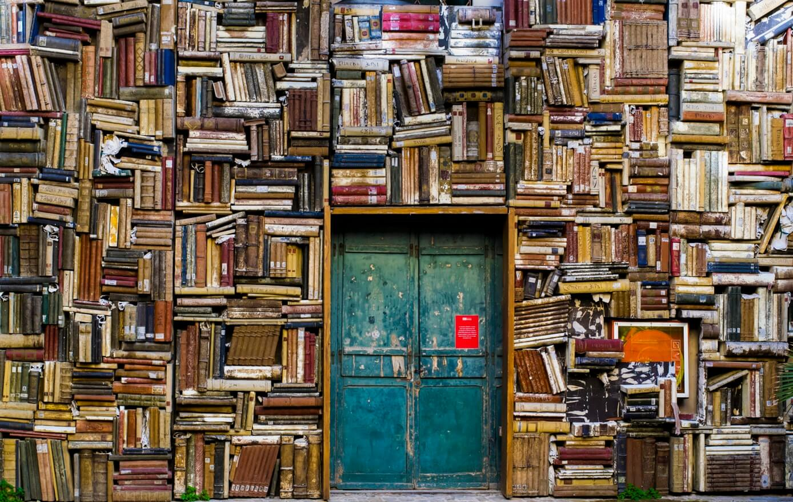
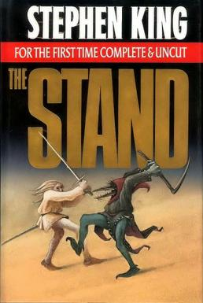
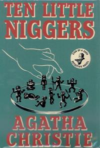
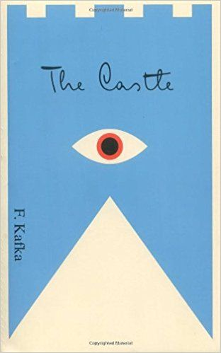

Hi!   
As my first post in this blog I thought it would be nice to be something more _casual_ as per se      
So... When I was younger I was a bookworm    
Yet, I've lost the _"touch"_ of it   
I really want to get it back, so for that reason, I've settled a goal:   
I will read 12 books(non-tech) on this year of 2018.    

---
## Lots of Books     
     

> "Books are a uniquely portable magic." by *Stephen King*     

My 2018 book's to read list is as follow:

## #1 - The Stand
    
**Author** Stephen King     
**Status** _Read_     

## #2 - And Then There Was None     
     
**Author** Agatha Christie      
**Status** _Read_  

## #3 - The Castle     
     
**Author** Franz Kafka           
**Status** _Read_    

## #4 - The Martian   
      
**Author** Andy Weir    
**Status** _Read_   

## #5 - The Winter King   
        
**Author** Bernard Cornwell      
**Status** _Reading_     

## #6 - Valley of Terror   
        
**Author** Zhou Haohui         
**Status** _Reading_    

- Empty Slot
- Empty Slot
- Empty Slot
- Empty Slot
- Empty Slot    

---
Bye.
